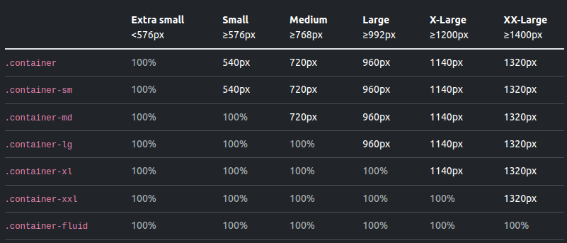
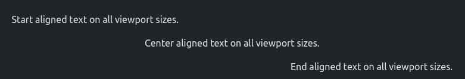
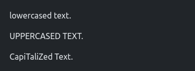
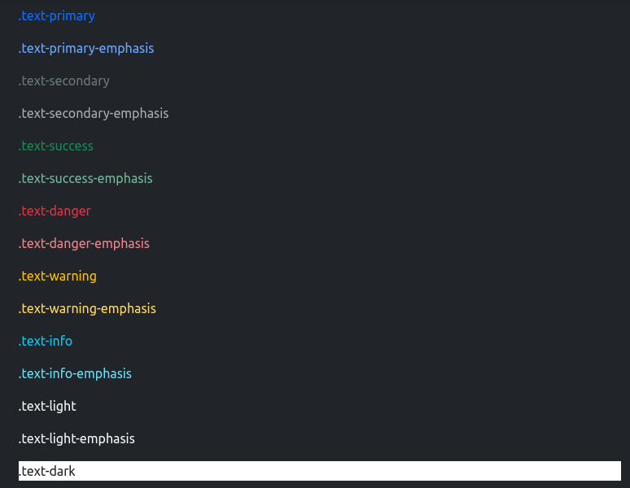
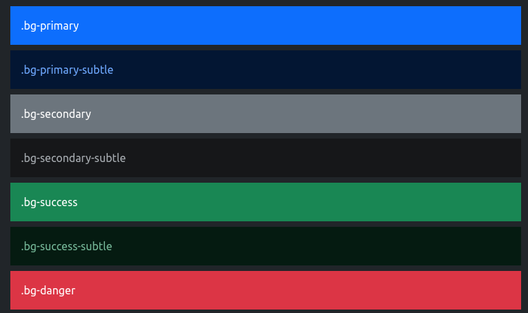
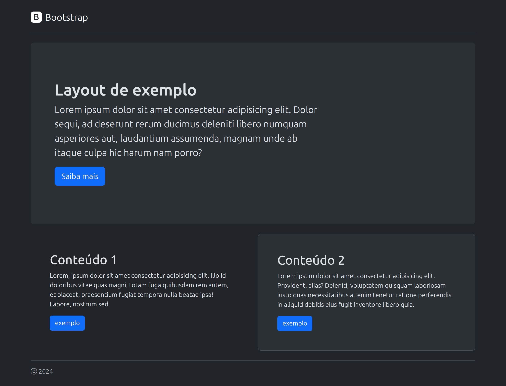

# Mini Curso de Bootstrap

#### [Introdução HTML Simples](#introdução-html-simples)

- Apresentação do Treinamento e Objetivos

#### [Configuração e Estrutura Básica](#configuração-e-estrutura-básica)

- Instalação do Bootstrap
- Estrutura Básica de um Documento HTML com Bootstrap

#### [Bootstrap básico](#sistema-de-linhas-e-colunas)

- Sistema de Linhas e Colunas
- Responsividade
- Espaçamentos
- Tipografia
- Cores
- Display
- Alinhamento
- Ícones
- Hands-on: Construção de Layout

#### [Componentes](#componentes-básicos)

- Componentes Comuns
- Criação de uma página completa

#### [Bootstrap Avançado](#avançado)

- Sass
- Customização Avançada
- Componentes Interativos
- Desafio Final

## Introdução HTML Simples

- O que é o Bootstrap e por que utilizá-lo.
- Principais funcionalidades e vantagens.

## Configuração e Estrutura Básica

**Instalação do Bootstrap**

- CDN vs. instalação local.
- Inclusão do Bootstrap em um projeto HTML.

**Estrutura Básica de um Documento HTML com Bootstrap**

- Estrutura básica do HTML5.
- Importação correta do CSS e JS do Bootstrap.

## Sistema de Linhas e Colunas

**Introdução ao Sistema de Linhas e Colunas**

Container padrão

   ```html
   <div class="container">
      seu conteúdo aqui
   </div>
   ```

Tipos de container

  

Container responsivo

```html
<div class="container-sm">pequeno</div>
<div class="container-md">médio</div>
<div class="container-lg">grande</div>
<div class="container-xl">extra grande</div>
<div class="container-xxl">extra extra grande</div>
```

container fluido

```html
<div class="container-fluid">
  ...
</div>
```

Linhas e Colunas

##### Explicação do Sistema de Grid de 12 Colunas no Bootstrap

O Bootstrap utiliza um sistema de grid baseado em 12 colunas, o que facilita a criação de layouts responsivos. O conceito principal é dividir a largura total de uma linha em 12 partes iguais. Você pode combinar essas partes para criar diferentes layouts.

##### Estrutura Básica

Container: O elemento que contém o grid.

Row: As linhas dentro do container que agruparão as colunas.

Coluna: Cada coluna dentro de uma linha. As colunas são criadas usando classes específicas que determinam quantas colunas (das 12 disponíveis) o elemento ocupará.

Classes de Colunas

As classes de colunas seguem o formato col-{tamanho}, onde {tamanho} pode ser um número de 1 a 12, representando o número de colunas que o elemento ocupará.

```html
<div class="container text-center">
  <div class="row">
    <!-- Primeira coluna que ocupa uma fração igual do espaço disponível -->
    <div class="col">
      1 of 2
    </div>
    <!-- Segunda coluna que ocupa uma fração igual do espaço disponível -->
    <div class="col">
      2 of 2
    </div>
  </div>
  <div class="row">
    <!-- Primeira coluna que ocupa uma fração igual do espaço disponível -->
    <div class="col">
      1 of 3
    </div>
    <!-- Segunda coluna que ocupa uma fração igual do espaço disponível -->
    <div class="col">
      2 of 3
    </div>
    <!-- Terceira coluna que ocupa uma fração igual do espaço disponível -->
    <div class="col">
      3 of 3
    </div>
  </div>
</div>
```


exemplo 2

```html
<div class="container text-center">
  <div class="row">
    <!-- Primeira coluna que ocupa uma fração igual do espaço disponível -->
    <div class="col">col</div>
    <!-- Segunda coluna que ocupa uma fração igual do espaço disponível -->
    <div class="col">col</div>
    <!-- Terceira coluna que ocupa uma fração igual do espaço disponível -->
    <div class="col">col</div>
    <!-- Quarta coluna que ocupa uma fração igual do espaço disponível -->
    <div class="col">col</div>
  </div>

  <div class="row">
    <!-- Coluna que ocupa 8/12 do espaço disponível (66.67%) -->
    <div class="col-8">col-8</div>
    <!-- Coluna que ocupa 4/12 do espaço disponível (33.33%) -->
    <div class="col-4">col-4</div>
  </div>
</div>

```


**Margin e Padding**

Entendendo o uso dos espaçamentos.

No Bootstrap, você pode utilizar classes utilitárias para definir margens e paddings nos elementos. Estas classes são compostas por propriedades, lados e tamanhos.

#### Propriedades
| Propriedade | Descrição            |
| ----------- | -------------------- |
| m           | Para definir margem  |
| p           | Para definir padding |

#### Lados
| Lado        | Descrição                                                      |
| ----------- | -------------------------------------------------------------- |
| t           | Para definir margin-top ou padding-top                         |
| b           | Para definir margin-bottom ou padding-bottom                   |
| s           | (start) Para definir margin-left ou padding-left               |
| e           | (end) Para definir margin-right ou padding-right               |
| x           | Para definir tanto *-left quanto *-right                       |
| y           | Para definir tanto *-top quanto *-bottom                       |
| (em branco) | Para definir margem ou padding em todos os 4 lados do elemento |

#### Tamanhos
| Tamanho | Descrição                                                        |
| ------- | ---------------------------------------------------------------- |
| 0       | Para eliminar a margem ou padding, definindo-a como 0            |
| 1       | (por padrão) Para definir a margem ou padding para $spacer * .25 |
| 2       | (por padrão) Para definir a margem ou padding para $spacer * .5  |
| 3       | (por padrão) Para definir a margem ou padding para $spacer       |
| 4       | (por padrão) Para definir a margem ou padding para $spacer * 1.5 |
| 5       | (por padrão) Para definir a margem ou padding para $spacer * 3   |
| auto    | Para definir a margem como auto                                  |

Você pode adicionar mais tamanhos adicionando entradas à variável de mapa `$spacers` no Sass.

### Exemplo de Uso

```html
<!-- Margem inferior de 3 -->
<div class="mb-3"></div>

<!-- Padding em todos os lados de 1 -->
<div class="p-1"></div>

<!-- Margem superior e inferior (eixo y) de 4 -->
<div class="my-4"></div>

<!-- Margem direita e esquerda (eixo x) de 4 -->
<div class="mx-4"></div>

<!-- Padding à esquerda (start) de 2 -->
<div class="ps-2"></div>

<!-- Margem automática à esquerda e direita -->
<div class="mx-auto"></div>
```

**Tipografia**

Uso de fontes
  
```html
<p class="text-start">Start aligned text on all viewport sizes.</p>
<p class="text-center">Center aligned text on all viewport sizes.</p>
<p class="text-end">End aligned text on all viewport sizes.</p>
```


```html
<p class="text-lowercase">Lowercased text.</p>
<p class="text-uppercase">Uppercased text.</p>
<p class="text-capitalize">CapiTaliZed text.</p>
```



Titulos

```html
<h1>h1. Bootstrap heading</h1>
<h2>h2. Bootstrap heading</h2>
<h3>h3. Bootstrap heading</h3>
<h4>h4. Bootstrap heading</h4>
<h5>h5. Bootstrap heading</h5>
<h6>h6. Bootstrap heading</h6>
```


**Uso de cores**

Cores padrões

| Cor        | Classe de Texto   | Classe de Fundo | Classe de Borda     |
| ---------- | ----------------- | --------------- | ------------------- |
| Primária   | `.text-primary`   | `.bg-primary`   | `.border-primary`   |
| Secundária | `.text-secondary` | `.bg-secondary` | `.border-secondary` |
| Sucesso    | `.text-success`   | `.bg-success`   | `.border-success`   |
| Perigo     | `.text-danger`    | `.bg-danger`    | `.border-danger`    |
| Aviso      | `.text-warning`   | `.bg-warning`   | `.border-warning`   |
| Informação | `.text-info`      | `.bg-info`      | `.border-info`      |
| Claro      | `.text-light`     | `.bg-light`     | `.border-light`     |
| Escuro     | `.text-dark`      | `.bg-dark`      | `.border-dark`      |
| Corpo      | `.text-body`      | `.bg-body`      | `.border-body`      |
| Branco     | `.text-white`     | `.bg-white`     | `.border-white`     |
| Preto      | `.text-black`     | `.bg-black`     | `.border-black`     |

Exemplo, cores em textos

```html
<p class="text-primary">.text-primary</p>
<p class="text-primary-emphasis">.text-primary-emphasis</p>
<p class="text-secondary">.text-secondary</p>
<p class="text-secondary-emphasis">.text-secondary-emphasis</p>
<p class="text-success">.text-success</p>
<p class="text-success-emphasis">.text-success-emphasis</p>
<p class="text-danger">.text-danger</p>
<p class="text-danger-emphasis">.text-danger-emphasis</p>
<p class="text-warning">.text-warning</p>
<p class="text-warning-emphasis">.text-warning-emphasis</p>
<p class="text-info">.text-info</p>
<p class="text-info-emphasis">.text-info-emphasis</p>
<p class="text-light">.text-light</p>
<p class="text-light-emphasis">.text-light-emphasis</p>
<p class="text-dark bg-white">.text-dark</p>
```



exemplo, cores em background

```html
<div class="p-3 mb-2 bg-primary text-white">.bg-primary</div>
<div class="p-3 mb-2 bg-primary-subtle text-primary-emphasis">.bg-primary-subtle</div>
<div class="p-3 mb-2 bg-secondary text-white">.bg-secondary</div>
<div class="p-3 mb-2 bg-secondary-subtle text-secondary-emphasis">.bg-secondary-subtle</div>
<div class="p-3 mb-2 bg-success text-white">.bg-success</div>
<div class="p-3 mb-2 bg-success-subtle text-success-emphasis">.bg-success-subtle</div>
<div class="p-3 mb-2 bg-danger text-white">.bg-danger</div>
```



**Botões**
  
```html
<button type="button" class="btn btn-primary">Primary</button>
<button type="button" class="btn btn-secondary">Secondary</button>
<button type="button" class="btn btn-success">Success</button>
<button type="button" class="btn btn-danger">Danger</button>
<button type="button" class="btn btn-warning">Warning</button>
<button type="button" class="btn btn-info">Info</button>
<button type="button" class="btn btn-light">Light</button>
<button type="button" class="btn btn-dark">Dark</button>

<button type="button" class="btn btn-link">Link</button>
```


**Display**

| Classe           | Descrição                                                                                                                                                    | Exemplo de Uso                          |
| ---------------- | ------------------------------------------------------------------------------------------------------------------------------------------------------------ | --------------------------------------- |
| `d-inline`       | Exibe um elemento como um elemento de bloco inline, permitindo que outros elementos fiquem ao lado dele.                                                     | `<span class="d-inline">...</span>`     |
| `d-inline-block` | Exibe um elemento como um elemento de bloco inline, mas com a capacidade de definir largura e altura.                                                        | `<div class="d-inline-block">...</div>` |
| `d-block`        | Exibe um elemento como um elemento de bloco padrão, que ocupa toda a largura disponível e começa em uma nova linha.                                          | `<div class="d-block">...</div>`        |
| `d-flex`         | Transforma um elemento em um container flexível, permitindo o uso de flexbox para controle de layout flexível.                                               | `<div class="d-flex">...</div>`         |
| `d-grid`         | Transforma um elemento em um container de grid, permitindo o uso de grid CSS para layout.                                                                    | `<div class="d-grid">...</div>`         |
| `d-table`        | Exibe um elemento como um elemento de tabela, similar ao `<table>`, mas usando CSS para controle de layout.                                                  | `<div class="d-table">...</div>`        |
| `d-none`         | Oculta um elemento, removendo-o do fluxo do documento.                                                                                                       | `<div class="d-none">...</div>`         |
| `d-*`            | Para outros valores de `*`, como `d-inline-flex`, `d-inline-table`, `d-table-cell`, etc., que combinam comportamentos para controlar a exibição do elemento. | `<div class="d-inline-flex">...</div>`  |

**Alinhamento Vertial**

| Método de Alinhamento Vertical | Descrição                                                                                         | Exemplo de Uso                                       |
| ------------------------------ | ------------------------------------------------------------------------------------------------- | ---------------------------------------------------- |
| `align-items-center`           | Alinha os itens verticalmente ao centro dentro de um container flex usando `d-flex`.              | `<div class="d-flex align-items-center">...</div>`   |
| `align-middle`                 | Alinha um único item verticalmente ao centro dentro de um container flex usando `d-inline-block`. | `<div class="d-inline-block align-middle">...</div>` |

**Ícones**

[Documentaçao](https://icons.getbootstrap.com/)

```html
<i class="bi bi-bootstrap-fill"></i>
```


**Hands-on: Construção de Layout**

- Exercício prático de construção de um layout utilizando o sistema de linhas e colunas.
  


## Componentes Básicos

**Componentes Comuns**

- Navbars, Cards, Formulários, Badge.
  
**Criação de uma Página Completa**

- Exercício prático: construção de uma página web utilizando os componentes aprendidos.
[Exemplo](https://getbootstrap.com/docs/5.3/examples/checkout/)

## Avançado

**Sass**

- Sintaxe
- Aninhamento
- Variáveis
- Mixins e Extends

**Customização Avançada**

- Utilização de Sass para customização.
- Variáveis e temas.
  
**Componentes Interativos com javascript**

- Carousels, Modals, Tabs, Tooltip.
- Introdução ao JavaScript do Bootstrap.

**Hands-on: Desafio Final**

- [Desafio](https://696871.commercesuite.com.br/checkout/cart/gift-wraps?store_id=696871&session_id=0hs9vn9ah97vjps4uut8liksq3&id_items=4182)

## Conclusão

 **Resumo e Perguntas**

- Recapitulação dos principais pontos abordados.
- Sessão de perguntas e respostas.
