# Mini Curso de Bootstrap

#### Configuração e Estrutura Básica

- Instalação do Bootstrap
- Estrutura Básica de um Documento HTML com Bootstrap

#### Bootstrap básico

- Sistema de Linhas e Colunas
- Responsividade
- Espaçamentos
- Tipografia
- Cores
- Display
- Alinhamento
- Ícones
- Hands-on: Construção de Layout

#### Componentes

- Componentes
- Forms
- Criação de uma página completa

#### Bootstrap Avançado

- Sass
- Customização Avançada
- Desafio Final

## Introdução

O Bootstrap facilita a criação de sites responsivos e esteticamente agradáveis com menos esforço e tempo.

O Bootstrap é um framework CSS de código aberto desenvolvido pelo [Twitter](https://github.com/twbs/bootstrap/tree/v1.0.0). Ele fornece uma coleção de ferramentas e componentes pré-desenhados que ajudam a construir interfaces de usuário de forma rápida e eficiente

Por que aprender Bootstrap?

- Facilidade de uso
- Responsividade
- Componentes

## Configuração e Estrutura Básica

**Instalação do Bootstrap**

**CDN**: Oferece melhor desempenho e fácil integração com cache e distribuição global, mas depende de servidores externos.

**Instalação Local**: Proporciona controle total e segurança dos arquivos com a capacidade de trabalhar offline, mas requer manutenção manual das atualizações

**Estrutura Básica de um Documento HTML com Bootstrap**

- Estrutura básica do HTML5.
- Importação correta do CSS e JS do Bootstrap (ordem de carregamento).

  
### Ordem de Carregamento e Prioridade do CSS

A ordem de carregamento e a prioridade do CSS determinam quais estilos serão aplicados quando houver conflitos. Aqui está como o navegador lida com diferentes tipos de CSS:

#### 1. **CSS do Navegador (Estilos Padrão)**
 - Todo navegador aplica um estilo padrão aos elementos HTML.
 - Esses estilos fornecem uma base para a página, como margens para o `<body>`, fontes, etc.

#### 2. **CSS Externo (Arquivo CSS)**
 - Arquivos CSS externos são incluídos com a tag `<link>` no `<head>` do documento HTML.
 - São carregados de acordo com a ordem em que aparecem no HTML. O último arquivo pode sobrescrever as regras dos anteriores.

  ```html
  <link rel="stylesheet" href="styles.css">
  ```

#### 3. **CSS Interno (Tag `<style>` no HTML)**
- Estilos declarados dentro da tag `<style>` no próprio documento HTML, geralmente no `<head>`, têm prioridade sobre o CSS externo.

```html
<style>
  body { 
    background-color: lightblue;
  }
</style>
```

#### 4. **CSS Inline (Atributo `style` nos elementos HTML)**
- CSS inline é inserido diretamente no atributo `style` de um elemento HTML e tem mais prioridade do que o CSS externo e interno.

```html
<div style="color: red;">Texto em vermelho</div>
```

#### 5. **Estilos com `!important`**
- Qualquer estilo (externo, interno ou inline) com a regra `!important` tem a maior prioridade e sobrescreve qualquer outro estilo, independentemente da origem.
- Exemplo:
```css
p { color: blue !important; }
```

### Ordem de Prioridade (da menor para a maior)
1. CSS padrão do navegador
2. CSS externo (arquivos `.css`)
3. CSS interno (`<style>` no HTML)
4. CSS inline (`style` nos elementos)
5. Estilos com `!important` (independentemente da origem)

Essa hierarquia garante que o estilo mais próximo do elemento (como inline) tenha mais peso, mas `!important` pode sobrepor qualquer regra, se necessário.

## Entendendo os Modificadores Bootstrap

Imagine que você tem uma **camisa** básica e deseja personalizá-la com diferentes características.Os **modificadores** são usados para adicionar ou alterar essas características, e eles são representados por sufixos com um traço (`-`).

#### 1. Camisa Básica

classe base

```css
.camisa {
  background-color: white;
  color: black;
  font-size: 16px; /* Tamanho médio */
  padding: 10px;
  border: 1px solid #000;
}
```
```html
<div class="camisa">
  Camisa Básica
</div>
```

#### 2. Camisa Vermelha

(Vermelha, P)
```css
.camisa-vermelha {
  background-color: red;
  color: white;
}
```
```html
<div class="camisa camisa-vermelha">
  Camisa Vermelha
</div>
```

#### 2. Camisa Azul Grande

```css
.camisa-azul {
  background-color: blue;
  color: white;
}

.camisa-grande {
  font-size: 20px; /**Tamanho grande */
}
```
(Azul, G)
```html
<div class="camisa camisa-azul camisa-grande">
  Camisa Azul Grande
</div>
```

## Sistema de Linhas e Colunas

**Introdução ao Sistema de Linhas e Colunas**

Container padrão

```html
<div class="container">
</div>
```

Tipos de container

  

Container responsivo

```html
<div class="container-sm">pequeno</div>
<div class="container-md">médio</div>
<div class="container-lg">grande</div>
<div class="container-xl">extra grande</div>
<div class="container-xxl">extra extra grande</div>
```

container fluido

```html
<div class="container-fluid">
  ...
</div>
```

Linhas e Colunas

##### Explicação do Sistema de Grid de 12 Colunas no Bootstrap

O Bootstrap utiliza um sistema de grid baseado em 12 colunas, o que facilita a criação de layouts responsivos. O conceito principal é dividir a largura total de uma linha em 12 partes iguais. Você pode combinar essas partes para criar diferentes layouts.

##### Estrutura Básica

Container: O elemento que contém o grid.

Row: As linhas dentro do container que agruparão as colunas.

Coluna: Cada coluna dentro de uma linha. As colunas são criadas usando classes específicas que determinam quantas colunas (das 12 disponíveis) o elemento ocupará.

Classes de Colunas

As classes de colunas seguem o formato col-{tamanho}, onde {tamanho} pode ser um número de 1 a 12, representando o número de colunas que o elemento ocupará.

```html
<div class="container text-center">
  <div class="row">
    <div class="col">
      Primeira coluna que ocupa uma fração igual do espaço disponível
    </div>
    <div class="col">
      Segunda coluna que ocupa uma fração igual do espaço disponível
    </div>
  </div>
  <div class="row">
    <div class="col">
     Primeira coluna que ocupa uma fração igual do espaço disponível
    </div>
    <div class="col">
      Segunda coluna que ocupa uma fração igual do espaço disponível
    </div>
    <div class="col">
      Terceira coluna que ocupa uma fração igual do espaço disponível
    </div>
  </div>
</div>
```


exemplo 2

```html
<div class="container text-center">
  <div class="row">
    <div class="col">Primeira coluna que ocupa uma fração igual do espaço disponível</div>
    <div class="col">Segunda coluna que ocupa uma fração igual do espaço disponível</div>
    <div class="col">Terceira coluna que ocupa uma fração igual do espaço disponível</div>
    <div class="col">Quarta coluna que ocupa uma fração igual do espaço disponível</div>
  </div>

  <div class="row">
    <div class="col-8">Coluna que ocupa 8/12 do espaço disponível</div>
    <div class="col-4">Coluna que ocupa 4/12 do espaço disponível (33.33%)</div>
  </div>
</div>

```


**Margin e Padding**

Entendendo o uso dos espaçamentos.

No Bootstrap, você pode utilizar classes utilitárias para definir margens e paddings nos elementos. Estas classes são compostas por propriedades, lados e tamanhos.

#### Propriedades
| Propriedade | Descrição            |
| ----------- | -------------------- |
| m           | Para definir margem  |
| p           | Para definir padding |

#### Lados
| Lado        | Descrição                                                      |
| ----------- | -------------------------------------------------------------- |
| t           | Para definir margin-top ou padding-top                         |
| b           | Para definir margin-bottom ou padding-bottom                   |
| s           | (start) Para definir margin-left ou padding-left               |
| e           | (end) Para definir margin-right ou padding-right               |
| x           | Para definir tanto *-left quanto *-right                       |
| y           | Para definir tanto *-top quanto *-bottom                       |
| (em branco) | Para definir margem ou padding em todos os 4 lados do elemento |

#### Tamanhos
| Tamanho | Descrição                                                        |
| ------- | ---------------------------------------------------------------- |
| 0       | Para eliminar a margem ou padding, definindo-a como 0            |
| 1       | (por padrão) Para definir a margem ou padding para $spacer * .25 |
| 2       | (por padrão) Para definir a margem ou padding para $spacer * .5  |
| 3       | (por padrão) Para definir a margem ou padding para $spacer       |
| 4       | (por padrão) Para definir a margem ou padding para $spacer * 1.5 |
| 5       | (por padrão) Para definir a margem ou padding para $spacer * 3   |
| auto    | Para definir a margem como auto                                  |

Você pode adicionar mais tamanhos adicionando entradas à variável de mapa `$spacers` no Sass.

### Exemplo de Uso

```html
<div class="mb-3">Margem inferior de 3</div>
<div class="p-1">Padding em todos os lados de 1</div>
<div class="my-4">Margem superior e inferior (eixo y) de 4</div>
<div class="mx-4">Margem direita e esquerda (eixo x) de 4</div>
<div class="ps-2">Padding à esquerda (start) de 2</div>
<div class="mx-auto">Margem automática à esquerda e direita</div>
```

**Tipografia**

Uso de fontes
  
```html
<p class="text-start">Start aligned text on all viewport sizes.</p>
<p class="text-center">Center aligned text on all viewport sizes.</p>
<p class="text-end">End aligned text on all viewport sizes.</p>
```


```html
<p class="text-lowercase">Lowercased text.</p>
<p class="text-uppercase">Uppercased text.</p>
<p class="text-capitalize">CapiTaliZed text.</p>
```


Titulos

```html
<div class="container text-center text-warning mt-4 d-flex flex-column-reverse">
    <h1>h1. Bootstrap heading</h1>
    <h2>h2. Bootstrap heading</h2>
    <h3>h3. Bootstrap heading</h3>
    <h4>h4. Bootstrap heading</h4>
    <h5>h5. Bootstrap heading</h5>
    <h6>h6. Bootstrap heading</h6>
</div>
```


**Uso de cores**

Cores padrões

| Cor        | Classe de Texto   | Classe de Fundo | Classe de Borda     |
| ---------- | ----------------- | --------------- | ------------------- |
| Primária   | `.text-primary`   | `.bg-primary`   | `.border-primary`   |
| Secundária | `.text-secondary` | `.bg-secondary` | `.border-secondary` |
| Sucesso    | `.text-success`   | `.bg-success`   | `.border-success`   |
| Perigo     | `.text-danger`    | `.bg-danger`    | `.border-danger`    |
| Aviso      | `.text-warning`   | `.bg-warning`   | `.border-warning`   |
| Informação | `.text-info`      | `.bg-info`      | `.border-info`      |
| Claro      | `.text-light`     | `.bg-light`     | `.border-light`     |
| Escuro     | `.text-dark`      | `.bg-dark`      | `.border-dark`      |
| Corpo      | `.text-body`      | `.bg-body`      | `.border-body`      |
| Branco     | `.text-white`     | `.bg-white`     | `.border-white`     |
| Preto      | `.text-black`     | `.bg-black`     | `.border-black`     |

Exemplo, cores em textos

```html
<p class="text-primary">.text-primary</p>
<p class="text-primary-emphasis">.text-primary-emphasis</p>
<p class="text-secondary">.text-secondary</p>
<p class="text-secondary-emphasis">.text-secondary-emphasis</p>
<p class="text-success">.text-success</p>
<p class="text-success-emphasis">.text-success-emphasis</p>
<p class="text-danger">.text-danger</p>
<p class="text-danger-emphasis">.text-danger-emphasis</p>
<p class="text-warning">.text-warning</p>
<p class="text-warning-emphasis">.text-warning-emphasis</p>
<p class="text-info">.text-info</p>
<p class="text-info-emphasis">.text-info-emphasis</p>
<p class="text-light">.text-light</p>
<p class="text-light-emphasis">.text-light-emphasis</p>
<p class="text-dark bg-white">.text-dark</p>
```


exemplo, cores em background

```html
<div class="p-3 mb-2 bg-primary text-white">.bg-primary</div>
<div class="p-3 mb-2 bg-primary-subtle text-primary-emphasis">.bg-primary-subtle</div>
<div class="p-3 mb-2 bg-secondary text-white">.bg-secondary</div>
<div class="p-3 mb-2 bg-secondary-subtle text-secondary-emphasis">.bg-secondary-subtle</div>
<div class="p-3 mb-2 bg-success text-white">.bg-success</div>
<div class="p-3 mb-2 bg-success-subtle text-success-emphasis">.bg-success-subtle</div>
<div class="p-3 mb-2 bg-danger text-white">.bg-danger</div>
```


**Botões**
  
```html
<button type="button" class="btn btn-primary">Primary</button>
<button type="button" class="btn btn-secondary">Secondary</button>
<button type="button" class="btn btn-success">Success</button>
<button type="button" class="btn btn-danger">Danger</button>
<button type="button" class="btn btn-warning">Warning</button>
<button type="button" class="btn btn-info">Info</button>
<button type="button" class="btn btn-light">Light</button>
<button type="button" class="btn btn-dark">Dark</button>

<button type="button" class="btn btn-link">Link</button>
```


**Display**

| Classe           | Descrição                                                                                                                                                    | Exemplo de Uso                          |
| ---------------- | ------------------------------------------------------------------------------------------------------------------------------------------------------------ | --------------------------------------- |
| `d-inline`       | Exibe um elemento como um elemento de bloco inline, permitindo que outros elementos fiquem ao lado dele.                                                     | `<span class="d-inline">...</span>`     |
| `d-inline-block` | Exibe um elemento como um elemento de bloco inline, mas com a capacidade de definir largura e altura.                                                        | `<div class="d-inline-block">...</div>` |
| `d-block`        | Exibe um elemento como um elemento de bloco padrão, que ocupa toda a largura disponível e começa em uma nova linha.                                          | `<div class="d-block">...</div>`        |
| `d-flex`         | Transforma um elemento em um container flexível, permitindo o uso de flexbox para controle de layout flexível.                                               | `<div class="d-flex">...</div>`         |
| `d-grid`         | Transforma um elemento em um container de grid, permitindo o uso de grid CSS para layout.                                                                    | `<div class="d-grid">...</div>`         |
| `d-table`        | Exibe um elemento como um elemento de tabela, similar ao `<table>`, mas usando CSS para controle de layout.                                                  | `<div class="d-table">...</div>`        |
| `d-none`         | Oculta um elemento, removendo-o do fluxo do documento.                                                                                                       | `<div class="d-none">...</div>`         |
| `d-*`            | Para outros valores de `*`, como `d-inline-flex`, `d-inline-table`, `d-table-cell`, etc., que combinam comportamentos para controlar a exibição do elemento. | `<div class="d-inline-flex">...</div>`  |

**Alinhamento**

Centralizando Texto

```html
<div class="text-center">
  Este texto está centralizado.
</div>
```

Centralizando Blocos

```html
<div class="container">
  <div class="row">
    <div class="col-md-6 mx-auto">
      Este bloco está centralizado horizontalmente.
    </div>
  </div>
</div>
```

Centralizando Horizontalmente e Verticalmente:

```html
<div class="d-flex justify-content-center align-items-center" style="height: 100vh;">
  <div class="text-center">
    Este bloco está centralizado horizontalmente e verticalmente.
  </div>
</div>
```

**Bordas**

Largura

```html
<span class="border border-1"></span>
<span class="border border-2"></span>
<span class="border border-3"></span>
<span class="border border-4"></span>
<span class="border border-5"></span>
```
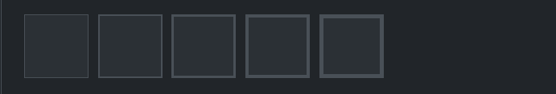

Cantos

```html


```

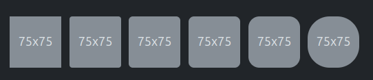

**Ícones**

[Documentaçao](https://icons.getbootstrap.com/)

```html
<i class="bi bi-bootstrap-fill"></i>
```


**Hands-on: Construção de Layout**

- Exercício prático de construção de um layout utilizando o sistema de linhas e colunas.
  


## Componentes

Cards
  
```html
    <div class="card p-2" style="width: 300px;">
        <div class="d-flex justify-content-center">
            
        </div>
        <div class="card-body">
            <h5 class="card-title">WHEY PROTEIN CONCENTRADO (1KG)</h5>
            <p class="card-text">Whey protein Growth fornece proteínas para quem deseja hipertrofia e definição
                muscular.</p>
            <a href="#" class="btn btn-primary">Comprar</a>
        </div>
    </div>
```
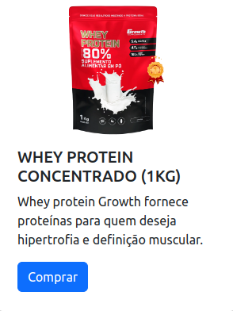

Badge

```html
<button type="button" class="btn btn-primary position-relative">
  Inbox
  <span class="position-absolute top-0 start-100 translate-middle badge rounded-pill bg-danger">
    99+
    <span class="visually-hidden">unread messages</span>
  </span>
</button>
```

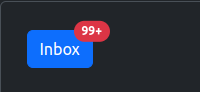
  
 [Veja lista completa de componentes](https://getbootstrap.com/docs/5.3/components/accordion/)

 **Forms**

 Form Control

 ```html
<div class="mb-3">
  <label for="exampleFormControlInput1" class="form-label">Email address</label>
  <input type="email" class="form-control" id="exampleFormControlInput1" placeholder="name@example.com">
</div>
<div class="mb-3">
  <label for="exampleFormControlTextarea1" class="form-label">Example textarea</label>
  <textarea class="form-control" id="exampleFormControlTextarea1" rows="3"></textarea>
</div>
 ```

 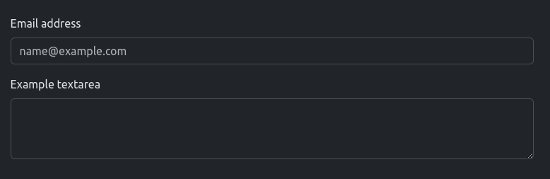

 Select

 ```html
 <select class="form-select" aria-label="Default select example">
  <option selected>Open this select menu</option>
  <option value="1">One</option>
  <option value="2">Two</option>
  <option value="3">Three</option>
</select>
 ```

 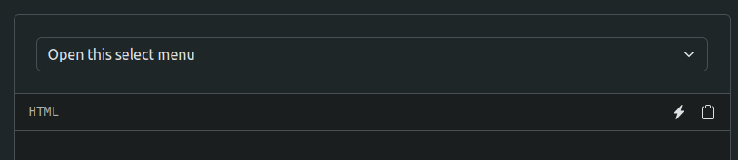
  
Checks & Radios

```html
<div class="form-check">
  <input class="form-check-input" type="checkbox" value="" id="flexCheckDefault">
  <label class="form-check-label" for="flexCheckDefault">
    Default checkbox
  </label>
</div>
<div class="form-check">
  <input class="form-check-input" type="checkbox" value="" id="flexCheckChecked" checked>
  <label class="form-check-label" for="flexCheckChecked">
    Checked checkbox
  </label>
</div>
```

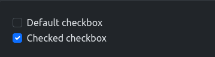

```html
<div class="form-check">
  <input class="form-check-input" type="radio" name="flexRadioDefault" id="flexRadioDefault1">
  <label class="form-check-label" for="flexRadioDefault1">
    Default radio
  </label>
</div>
<div class="form-check">
  <input class="form-check-input" type="radio" name="flexRadioDefault" id="flexRadioDefault2" checked>
  <label class="form-check-label" for="flexRadioDefault2">
    Default checked radio
  </label>
</div>
```

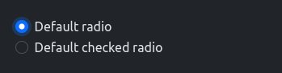

Input Group

```html
<div class="input-group flex-nowrap">
  <span class="input-group-text" id="addon-wrapping">@</span>
  <input type="text" class="form-control" placeholder="Username" aria-label="Username" aria-describedby="addon-wrapping">
</div>
```

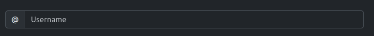

Floating Label

```html
<div class="form-floating mb-3">
  <input type="email" class="form-control" id="floatingInput" placeholder="name@example.com">
  <label for="floatingInput">Email address</label>
</div>
<div class="form-floating">
  <input type="password" class="form-control" id="floatingPassword" placeholder="Password">
  <label for="floatingPassword">Password</label>
</div>
```

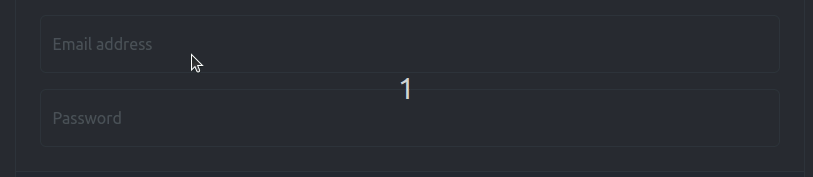

Form Validation

```html
<form class="row g-3 needs-validation" novalidate>
  <div class="col-md-4">
    <label for="validationCustom01" class="form-label">First name</label>
    <input type="text" class="form-control" id="validationCustom01" value="Mark" required>
    <div class="valid-feedback">
      Looks good!
    </div>
  </div>
  <div class="col-md-4">
    <label for="validationCustom02" class="form-label">Last name</label>
    <input type="text" class="form-control" id="validationCustom02" value="Otto" required>
    <div class="valid-feedback">
      Looks good!
    </div>
  </div>
  <div class="col-md-4">
    <label for="validationCustomUsername" class="form-label">Username</label>
    <div class="input-group has-validation">
      <span class="input-group-text" id="inputGroupPrepend">@</span>
      <input type="text" class="form-control" id="validationCustomUsername" aria-describedby="inputGroupPrepend" required>
      <div class="invalid-feedback">
        Please choose a username.
      </div>
    </div>
  </div>
  <div class="col-md-6">
    <label for="validationCustom03" class="form-label">City</label>
    <input type="text" class="form-control" id="validationCustom03" required>
    <div class="invalid-feedback">
      Please provide a valid city.
    </div>
  </div>
  <div class="col-md-3">
    <label for="validationCustom04" class="form-label">State</label>
    <select class="form-select" id="validationCustom04" required>
      <option selected disabled value="">Choose...</option>
      <option>...</option>
    </select>
    <div class="invalid-feedback">
      Please select a valid state.
    </div>
  </div>
  <div class="col-md-3">
    <label for="validationCustom05" class="form-label">Zip</label>
    <input type="text" class="form-control" id="validationCustom05" required>
    <div class="invalid-feedback">
      Please provide a valid zip.
    </div>
  </div>
  <div class="col-12">
    <div class="form-check">
      <input class="form-check-input" type="checkbox" value="" id="invalidCheck" required>
      <label class="form-check-label" for="invalidCheck">
        Agree to terms and conditions
      </label>
      <div class="invalid-feedback">
        You must agree before submitting.
      </div>
    </div>
  </div>
  <div class="col-12">
    <button class="btn btn-primary" type="submit">Submit form</button>
  </div>
</form>
```

```js
(() => {
  'use strict'

  const forms = document.querySelectorAll('.needs-validation')

  Array.from(forms).forEach(form => {
    form.addEventListener('submit', event => {
      if (!form.checkValidity()) {
        event.preventDefault()
        event.stopPropagation()
      }

      form.classList.add('was-validated')
    }, false)
  })
})()
```

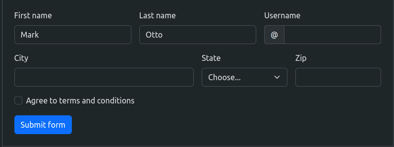

**Criação de uma Página Completa**

](./desafios/desafio-tray.png)

## Avançado

**Sass**
  
É uma ferramenta que estende as funcionalidades do CSS, permitindo que você escreva estilos de forma mais eficiente e organizada. Com o Sass, você pode usar recursos como variáveis, aninhamento de seletores, mixins (blocos de código reutilizáveis), herança, e operações matemáticas.

- [Aninhamento](https://sass-lang.com/documentation/style-rules/#nesting)
- [Variaveis](https://sass-lang.com/documentation/variables/)
  

o Sass é frequentemente usado em conjunto com a metodologia BEM (Block Element Modifier), que ajuda a organizar e padronizar o CSS para facilitar a manutenção e escalabilidade de projetos. A combinação do Sass com BEM torna o código mais legível e modular.

- [BEM (Block Element Modifier)](https://desenvolvimentoparaweb.com/css/bem/)
  
A estrutura BEM segue essa lógica de nomenclatura:

- **Bloco**: Representa um componente independente da interface, como um botão, um menu, etc.
- **Elemento**: É uma parte do bloco que cumpre uma função específica (usando dois underlines `__`).
- **Modificador**: Altera a aparência ou comportamento de um bloco ou elemento (usando dois hífens `--`).

exemplo:

```html
<div class="button button--primary">
  <span class="button__text">Click me</span>
</div>
```

```scss
$border-color: #ccc;
$bg-color: #f2f2f2;

.button {
  padding: 10px 20px;
  border: 1px solid $border-color;
  cursor: pointer;
  background-color: $bg-color;

  &__text {
    font-size: 16px;
    color: #333;
  }

  &--primary {
    background-color: #007bff;
    border-color: #007bff;
    color: white;

    &:hover {
      background-color: #0056b3;
    }
  }
}

```

Mixins e Extends

Mixin: É um bloco de código reutilizável que pode incluir propriedades, valores e até parâmetros. Você pode "chamar" um mixin em diferentes seletores, passando parâmetros para personalizar os estilos.

Extends: Permite herdar o conjunto de propriedades de outro seletor. Isso é útil quando vários seletores compartilham o mesmo estilo base.

- [Mixin](https://sass-lang.com/documentation/at-rules/mixin/)
- [Extend](https://sass-lang.com/documentation/at-rules/extend/)

```scss
@mixin border-radius($radius) {
  -webkit-border-radius: $radius;
  -moz-border-radius: $radius;
  border-radius: $radius;
}

.button {
  @include border-radius(10px);
  padding: 10px 20px;
  background-color: #3498db;
  color: white;
}

.flex {
  display: flex;
  align-items: center;
  justify-content: center;
}

.custom-container {
  @extend .flex;
  height: 100vh;
  background-color: #f0f0f0;
}
```

Funções

As funções são blocos de código que realizam cálculos ou transformações e retornam um valor, que pode ser usado nas propriedades de estilo. Elas são semelhantes às funções em linguagens de programação e permitem que você crie operações reutilizáveis, tornando o CSS mais dinâmico e fácil de manter.


```scss
@function px-to-rem($px, $base-font-size: 16px) {
  @return $px / $base-font-size * 1rem;
}

.container {
  width: px-to-rem(320px);
  padding: px-to-rem(16px);
  font-size: px-to-rem(14px);
  background-color: $primary-color;
}
``` 
Exemplo de como o Bootstrap monta o botão

https://github.com/twbs/bootstrap/blob/v5.3.3/scss/_buttons.scss 

**Customização Avançada**

[Documentação da instalação com Vite](https://getbootstrap.com/docs/5.3/getting-started/vite/)
[codesanbox](https://codesandbox.io/s/hopeful-leftpad-5r4wzd?file=/src/scss/styles.scss:3-117)

[Github do bootstrap](https://github.com/twbs/bootstrap)

[Variaveis](https://github.com/twbs/bootstrap/blob/main/scss/_variables.scss)

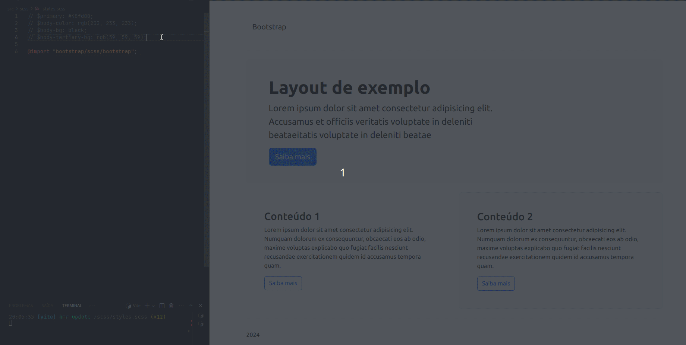

